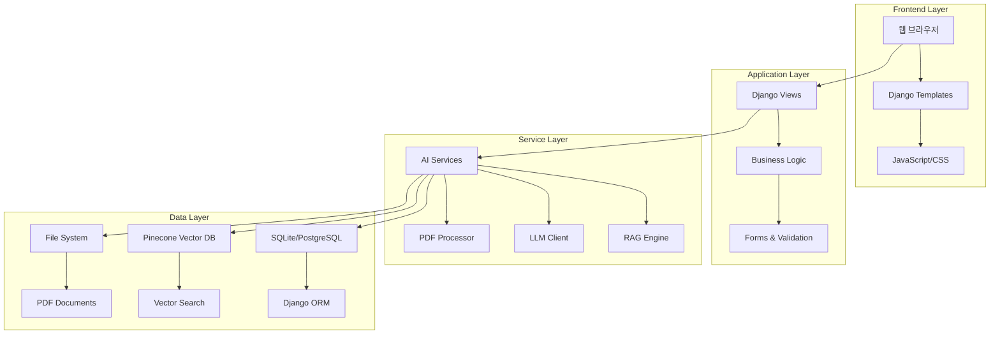
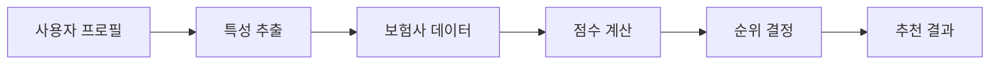
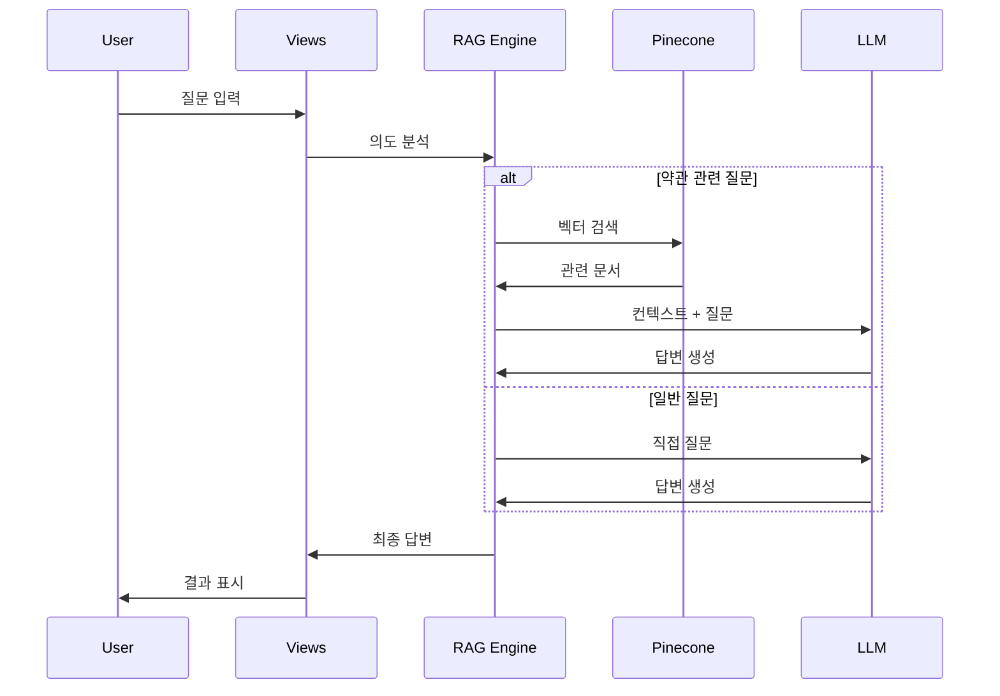
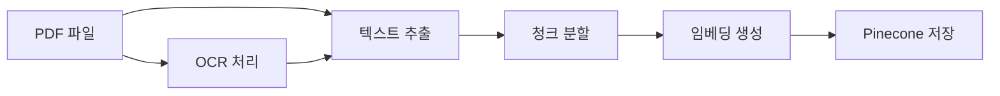
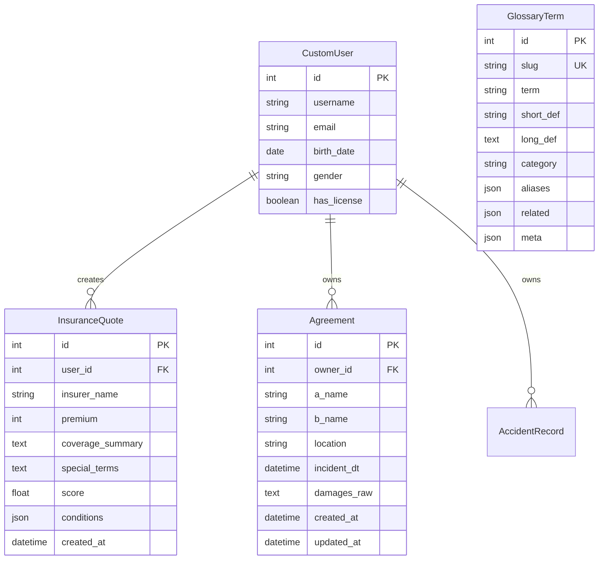

# AI 보험 플랫폼 설계 문서

## 개요

AI 보험 플랫폼은 Django 기반의 웹 애플리케이션으로, RAG(Retrieval-Augmented Generation) 기술과 벡터 검색을 활용하여 사용자에게 개인화된 보험 서비스를 제공합니다. 시스템은 모듈화된 아키텍처를 통해 확장성과 유지보수성을 보장합니다.

## 아키텍처

### 전체 시스템 아키텍처



### 애플리케이션 구조

시스템은 다음과 같은 주요 Django 앱으로 구성됩니다:

1. **insurance_project**: 메인 프로젝트 설정
2. **insurance_app**: 핵심 보험 기능
3. **accident_project**: 사고 관리 기능
4. **insurance_portal**: 지식 베이스 (아카이브)

## 컴포넌트 및 인터페이스

### 1. 사용자 인증 시스템

#### CustomUser 모델

```python
class CustomUser(AbstractUser):
    birth_date = DateField()      # 생년월일
    gender = CharField()          # 성별 (M/F/O)
    has_license = BooleanField()  # 운전면허 보유 여부
```

#### 인증 플로우

- 회원가입: 확장된 사용자 정보 수집
- 로그인: Django 기본 인증 + 세션 관리
- 프로필 관리: 이메일/비밀번호 변경 지원

### 2. AI 추천 엔진

#### 추천 알고리즘



#### InsuranceQuote 모델

```python
class InsuranceQuote(models.Model):
    user = ForeignKey(CustomUser)
    insurer_name = CharField()
    premium = IntegerField()
    coverage_summary = TextField()
    special_terms = TextField()
    score = FloatField()
    conditions = JSONField()
```

### 3. RAG 검색 시스템

#### 검색 파이프라인



#### 핵심 함수들

- `retrieve_insurance_clauses()`: Pinecone 벡터 검색
- `build_answer()`: 검색 결과 정제 및 답변 구성
- `detect_intent_for_router()`: 질문 의도 분석

### 4. 문서 처리 시스템

#### PDF 처리 파이프라인



#### EnhancedPDFProcessor 클래스

- PDF 텍스트 추출 (PyMuPDF, PyPDF2, pdfplumber)
- OCR 지원 (pytesseract)
- 청크 단위 분할
- 메타데이터 관리

### 5. 용어 사전 시스템

#### GlossaryTerm 모델

```python
class GlossaryTerm(models.Model):
    slug = SlugField()           # URL용 키
    term = CharField()           # 표제어
    short_def = CharField()      # 짧은 정의
    long_def = TextField()       # 긴 정의
    category = CharField()       # 분류
    aliases = JSONField()        # 동의어
    related = JSONField()        # 연관 용어
    meta = JSONField()          # 기타 메타데이터
```

#### 검색 기능

- 전문 검색 (용어명, 정의, 동의어)
- 카테고리 필터링
- 버킷 기반 분류 (보장/면책/금액)

### 6. 사고 관리 시스템

#### Agreement 모델

```python
class Agreement(models.Model):
    owner = ForeignKey(CustomUser)
    a_name = CharField()         # A 당사자
    b_name = CharField()         # B 당사자
    location = CharField()       # 사고 장소
    incident_dt = DateTimeField() # 사고 일시
    damages_raw = TextField()    # JSON 형태 상세 정보
    created_at = DateTimeField(auto_now_add=True)
    updated_at = DateTimeField(auto_now=True)
```

#### 현재 구현 상태 및 문제점

**구현된 기능:**

- 협의서 작성 (`agreement_form`, `agreement_submit`)
- 협의서 출력 (`agreement_print`)
- PDF/이미지 다운로드 (`agreement_pdf`, `agreement_image`)
- 마이페이지 목록 (`mypage_agreements`)
- 협의서 수정/삭제 (`agreement_edit`, `agreement_delete`)
- 미리보기 기능 (`agreement_preview`)

**문제점:**

1. **레거시 파일 중복**: `views.py`, `views old.py`, `views old_2(0824_01s).py` 공존
2. **폼 검증 복잡성**: `forms.py`에서 런타임 필드 체크 (`if "damages_raw" not in self.fields`)
3. **데이터 구조 불일치**: `damages_raw` 필드 처리 방식의 비일관성
4. **권한 처리 중복**: 여러 뷰에서 반복되는 소유자 확인 로직

#### 기능

- 시각적 차량 다이어그램
- 피해 부위 마킹 (JSON 형태 저장)
- PDF/이미지 출력 (reportlab 사용)
- 개인정보 마스킹 (`mask_rrn_value` 함수)
- CRUD 완전 지원 (생성, 조회, 수정, 삭제)

## 데이터 모델

### 핵심 엔티티 관계도



### 벡터 데이터베이스 스키마 (Pinecone)

```json
{
  "id": "unique_chunk_id",
  "values": [0.1, 0.2, ...],  // 임베딩 벡터
  "metadata": {
    "company": "보험사명",
    "file": "파일명.pdf",
    "page": 15,
    "chunk_idx": 3,
    "text": "원본 텍스트",
    "title": "조항 제목"
  }
}
```

## 오류 처리

### 1. API 오류 처리

- OpenAI API 실패: 대체 응답 메시지 제공
- Pinecone 연결 실패: 로컬 검색으로 폴백
- PDF 처리 실패: 다중 라이브러리 시도

### 2. 사용자 입력 검증

- Django Forms를 통한 서버사이드 검증
- JavaScript를 통한 클라이언트사이드 검증
- CSRF 보호 및 XSS 방지

### 3. 데이터 무결성

- 외래키 제약조건
- 유니크 제약조건
- JSON 필드 검증

## 테스트 전략

### 1. 단위 테스트

- 모델 메서드 테스트
- 유틸리티 함수 테스트
- 폼 검증 테스트

### 2. 통합 테스트

- API 엔드포인트 테스트
- 데이터베이스 연동 테스트
- 외부 서비스 연동 테스트

### 3. 성능 테스트

- 벡터 검색 응답 시간
- 대용량 PDF 처리 성능
- 동시 사용자 처리 능력

## 보안 고려사항

### 1. 인증 및 권한

- Django 기본 인증 시스템 활용
- 세션 기반 상태 관리
- 사용자별 데이터 접근 제어

### 2. 데이터 보호

- 환경 변수를 통한 민감 정보 관리
- 개인정보 마스킹 기능
- HTTPS 통신 (운영 환경)

### 3. 입력 검증

- SQL 인젝션 방지 (Django ORM)
- XSS 방지 (템플릿 자동 이스케이핑)
- CSRF 토큰 검증

## 성능 최적화

### 1. 데이터베이스 최적화

- 적절한 인덱스 설정
- 쿼리 최적화
- 연관 객체 프리로딩

### 2. 캐싱 전략

- 벡터 검색 결과 캐싱
- 정적 파일 캐싱
- 템플릿 캐싱

### 3. 비동기 처리

- PDF 처리 백그라운드 작업
- 벡터 임베딩 배치 처리
- 이메일 발송 큐잉

## 리팩토링 필요 사항

### 1. 폴더 구조 문제

**현재 문제:**

- `0826-5/` 아카이브 폴더에 중복된 경로 존재
- 경로: `/Volumes/DATA/mbc_project/rag-insure-bot/0826-5/Volumes/DATA/mbc_project/rag-insure-bot/accident_project`
- 팀원 작업물을 단순 복사하면서 발생한 중복 경로

**해결 방안:**

- 중복 경로 정리 및 필요한 파일만 적절한 위치로 이동
- `settings.py`의 경로 설정 업데이트

### 2. 코드 일관성 문제

**현재 문제:**

- 여러 버전의 뷰 파일 공존 (`views.py`, `views old.py`, `views old_2(0824_01s).py`)
- 동적 필드 처리의 복잡성 (`forms.py`의 런타임 체크)
- 모델 필드 존재 여부를 런타임에 체크하는 불안정한 구조

**해결 방안:**

- 레거시 파일 제거
- 모델 필드 명확한 정의
- 일관된 데이터 검증 로직 적용

### 3. 프론트엔드 일관성 문제

**현재 문제:**

- 각 앱별로 다른 디자인 시스템 사용
- JavaScript 파일들의 중복 기능 (`chatbot.js`, `fault_answer.js`, `fab-controller.js`)
- CSS 스타일의 불일치

**해결 방안:**

- 공통 디자인 토큰 정의
- JavaScript 모듈 통합 및 중복 제거
- 일관된 템플릿 구조 적용

## 확장성 고려사항

### 1. 수평 확장

- 로드 밸런서 지원
- 데이터베이스 읽기 복제본
- CDN을 통한 정적 파일 서빙

### 2. 마이크로서비스 분리

- AI 서비스 독립 배포
- 문서 처리 서비스 분리
- API 게이트웨이 도입

### 3. 클라우드 네이티브

- 컨테이너화 (Docker)
- 쿠버네티스 오케스트레이션
- 클라우드 스토리지 연동
